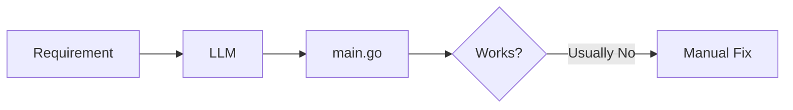
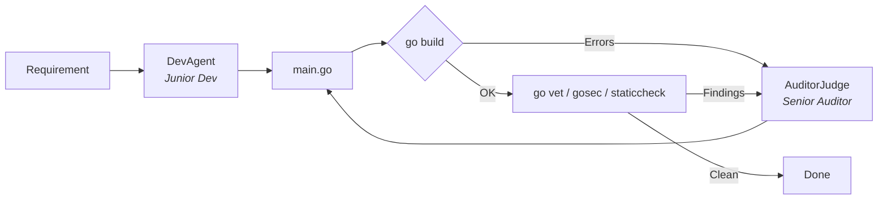
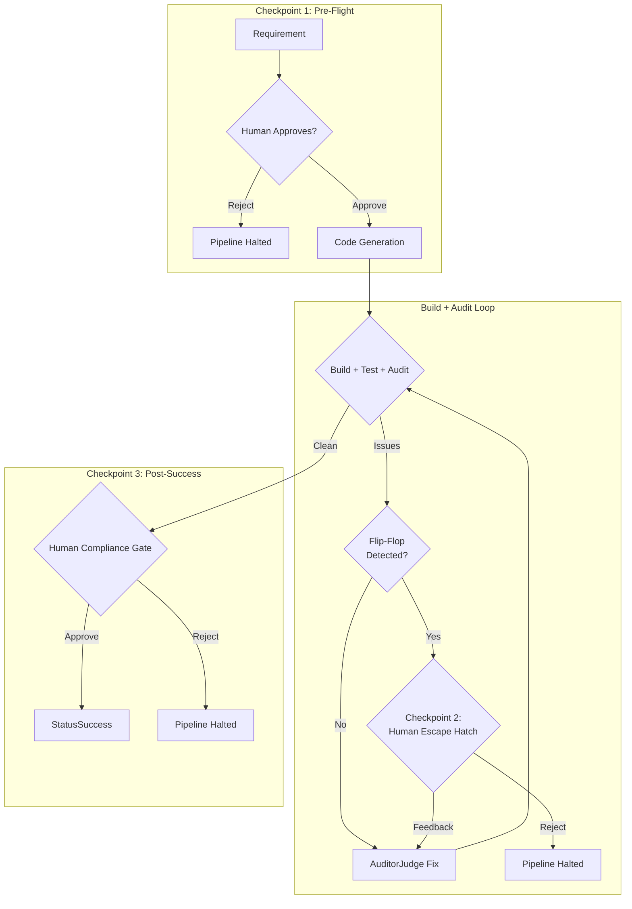
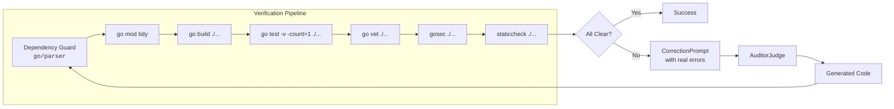
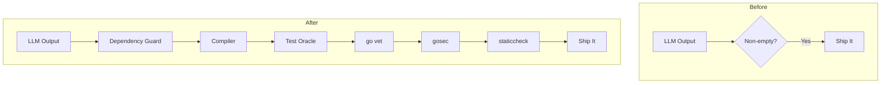
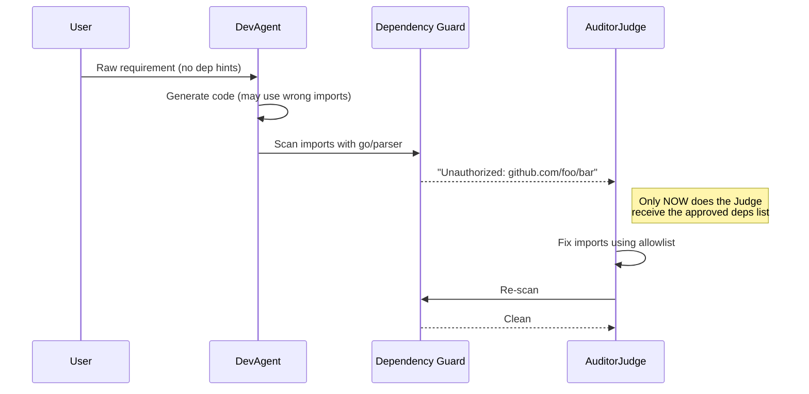
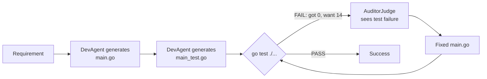
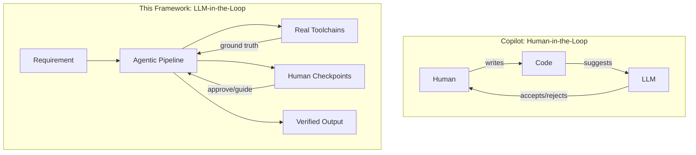

# Agentic Go Code Generator

A self-healing, policy-driven framework that generates, compiles, audits, and repairs Go code using LLM agents grounded in real-world toolchains.

> **TL;DR** — Instead of trusting an LLM to "get it right," we wrap it in a reconciliation loop with `go build`, `go test`, `go vet`, `gosec`, and `staticcheck`. The LLM proposes; the toolchain disposes.

---

## Table of Contents

1. [The Architectural Evolution](#1-the-architectural-evolution)
2. [Key Technical Improvements](#2-key-technical-improvements)
3. [Lessons Learned (The "Aha!" Moments)](#3-lessons-learned-the-aha-moments)
4. [Final Reflection](#4-final-reflection)
5. [Running the Framework](#5-running-the-framework)

---

## 1. The Architectural Evolution

We transitioned from a single prompt to a **Reconciler Pattern** — similar to Kubernetes controllers, where a desired state (working, secure Go code) is continuously reconciled against observed state (compiler errors, linter findings, test failures).

### Phase 1: The Basic Loop

**Requirement → LLM → File.** Failed on syntax.



The LLM would hallucinate imports, forget closing braces, and produce code that never compiled. There was no feedback mechanism — the model was flying blind.

### Phase 2: The Multi-Agent Pipeline

We split responsibilities into specialized personas with distinct system prompts:

| Agent | Role | Persona |
|-------|------|---------|
| **DevAgent** | Writer | Junior Go developer — writes fast, working code |
| **AuditorJudge** | Fixer | Senior Security Auditor — fixes ALL reported issues |
| **DependencyAgent** | Librarian | Curates approved external packages |



This separation matters: the DevAgent's system prompt encourages speed and creativity, while the AuditorJudge's prompt enforces correctness and security. The tension between the two personas produces better code than either alone.

### Phase 3: Human-in-the-Loop (HITL)

Added three critical checkpoints where human expertise is required:



**Why three checkpoints?**

1. **Requirement Sign-off** — Prevents wasted compute on misunderstood requirements.
2. **Flip-Flop Escape Hatch** — When the judge oscillates between the same two broken states, a human can provide the nudge it needs (e.g., "use a `switch` statement instead of nested `if`").
3. **Compliance Gate** — Even after all automated checks pass, a human reviews the final artifact before it's promoted to "success."

### Phase 4: Toolchain Grounding

Integrated real-world Go toolchains to provide **ground truth** back to the LLM:



Each tool provides structured, machine-readable output that is parsed into `Finding` structs with file, line, column, severity, rule ID, and message. The LLM sees **exactly** what the tool saw — no ambiguity, no hallucination of error messages.

---

## 2. Key Technical Improvements

### Verification: From "Did it generate text?" to "Does it pass the toolchain?"



| Aspect | Before | After |
|--------|--------|-------|
| **Verification** | "Did it generate text?" | Compiler & linter driven. Uses real error codes and `line:column` carets. |
| **Memory** | Stateless. Forgot previous errors. | **Attempt History** — injects up to 3 previous failures into the prompt to prevent flip-flopping. |
| **Dependencies** | Hallucinated imports. | **Allowlist Guard** — enforces specific versions (e.g., `google/uuid v1.6.0`) at build-time via `go/parser`. |
| **HITL** | Autonomous (black box). | **Interactive CLI** — pause for human feedback when the agent hits a logic wall. |
| **Success Criteria** | `go build` passes. | `go build` + `go test` + `go vet` + `gosec` + `staticcheck` all pass. |

### The CorrectionPrompt: How the LLM Sees Errors

The `CorrectionPrompt` is the single most important data structure. It renders tool output into a structured prompt with sections in strict priority order:

```
1. Allowed External Packages     (late-stage injection — only the auditor sees this)
2. Human Reviewer Feedback       (highest priority — from escape hatch)
3. Tool Findings                 (go vet, gosec, staticcheck with severity/rule/line)
4. Compiler Errors               (with annotated source and caret markers)
5. Attempt History               (last 3 failures — anti-flip-flop context)
6. Test Oracle                   (main_test.go — "your code MUST pass these tests")
7. Annotated Source              (current code with error markers)
```

### Dependency Management: The On-Demand Pattern



**Key insight:** The DevAgent never sees the dependency allowlist. It writes code naturally. The `DependencyGuard` catches unauthorized imports *before* compilation, and the `AuditorJudge` receives the allowlist as **late-stage injection** — only when it needs to fix a dependency violation.

---

## 3. Lessons Learned (The "Aha!" Moments)

### A. The "Path of Least Resistance" — Stub Fallacy

We learned that if the only success metric is a passing build, the LLM will "cheat" by writing stub implementations:

```go
// LLM's "working" calculator:
func Calculate(expr string) int {
    return 0  // Compiles. Passes go vet. Ships.
}
```

**The fix: Test-Driven Oracle.**



The `TestGenerator` produces a test file that encodes **expected behavior**. Test failures are fed back as build errors — the judge sees `"expected 14, got 0"` instead of a clean pass. The test file is immutable once generated; only `main.go` is repaired.

**Lesson:** Agents need **Behavioral Verification** (unit tests), not just **Syntactic Verification** (compiling).

### B. The Context Poisoning Problem

Giving the DevAgent the approved dependencies list early caused it to over-import them — even when unnecessary. A simple "Hello World" requirement would produce code importing `github.com/google/uuid` just to be "helpful."

```
# What the DevAgent saw:
"Build a Hello World server.
 Available packages: github.com/google/uuid v1.6.0, github.com/pkg/errors v0.9.1"

# What the DevAgent wrote:
import (
    "github.com/google/uuid"  // Why? Because you told me about it.
    "github.com/pkg/errors"   // Might as well use it!
)
```

**Lesson:** Use **Late-Stage Injection**. Let the DevAgent try first. Let the AuditorJudge or a strict DependencyGuard trim the imports. Information given too early becomes a bias.

### C. The 7B Parameter Ceiling

We hit the limit of what a 7B model (`codellama:7b-instruct`) can reason through. Simple syntax repairs? Excellent. Complex math parsers or multi-step algorithms? The model would loop endlessly.

| Task Complexity | 7B Performance | Notes |
|----------------|----------------|-------|
| Syntax repair | Excellent | Fix missing imports, braces, types |
| Simple HTTP server | Good | Familiar pattern, lots of training data |
| Math expression parser | Poor | Requires recursive descent reasoning |
| Concurrent pipeline | Failed | Cannot reason about goroutine lifecycles |

**Lesson:** Small models are great for **Syntax Repair**, but for **Architectural Logic**, you need either a bigger model (14B+) or Chain-of-Thought prompting that forces the model to plan before coding. The framework's value is that you can swap `codellama:7b` for `codellama:34b` or a cloud model by changing one flag — the reconciliation loop stays the same.

### D. The Approval Anchor

When a human "Approves" a requirement, the LLM treats that text as a literal constraint. A requirement like *"Build a calculator"* approved at Checkpoint 1 would produce oversimplified code — the model anchored to the brevity of the approved text.

**Lesson:** Decouple the **"Human Intent"** from the **"Technical Spec."** The approval is a gate, not a specification. Future iterations should expand approved requirements into detailed technical specs before generation.

### E. The Flip-Flop Trap

Without attempt history, the AuditorJudge would oscillate between two broken states indefinitely:

```
Attempt 1: Uses fmt.Sprintf    → gosec: "G104 unhandled error"
Attempt 2: Adds error handling  → staticcheck: "SA1006 unused variable"
Attempt 3: Removes variable     → gosec: "G104 unhandled error"  ← Same as Attempt 1
Attempt 4: Adds error handling  → staticcheck: "SA1006 unused variable"  ← Same as Attempt 2
...
```

**The fix:** `isFlipFlop()` compares the last two attempts' `BuildErrors` and `Findings` for identity. When detected, the loop pauses for human guidance via the escape hatch. The human's feedback is injected as the **highest-priority section** in the next `CorrectionPrompt`.

---

## 4. Final Reflection

> *"Why build this instead of just using GitHub Copilot?"*

Copilot is a **productivity tool for humans**. This framework is a **Policy-Driven Engineering System**.

By wrapping the LLM in an agentic loop with real-world toolchains (`gosec`, `staticcheck`, `go vet`) and human checkpoints, we've created a system that ensures **compliance, safety, and correctness by default** — essential for high-stakes environments like fiscal transaction processing.



The key differences:

| | Copilot | This Framework |
|---|---------|---------------|
| **Who drives?** | Human writes, AI suggests | AI writes, toolchain verifies, human gates |
| **Verification** | Human reads the diff | Compiler + linter + tests + security scanner |
| **Compliance** | Developer responsibility | Enforced by pipeline (gosec, dependency guard) |
| **Memory** | None across sessions | Attempt history prevents repeated mistakes |
| **Dependencies** | Whatever the model suggests | Allowlist-enforced with pinned versions |

---

## 5. Running the Framework

### Prerequisites

- Go 1.21+
- [Ollama](https://ollama.ai) with `codellama:7b-instruct` pulled
- Optional: `gosec`, `staticcheck` on PATH

### Quick Start

```bash
# Mock mode (no LLM required — uses pre-canned responses)
go run ./cmd/main.go

# Live mode with CodeLlama
go run ./cmd/main.go -live -requirement "Build a function that checks if a number is prime"

# Full HITL experience
go run ./cmd/main.go -live -review -requirement "Build a REST API that returns Fibonacci numbers"

# With timeout
go run ./cmd/main.go -live -review -timeout 5m -requirement "Build a math expression parser"
```

### Running Tests

```bash
go test ./...                          # All tests
go test ./pkg/orchestrator/ -v         # Verbose orchestrator tests
go test ./pkg/orchestrator/ -run HITL  # Only HITL tests
go test ./pkg/orchestrator/ -run Oracle # Only test oracle tests
```

### Project Structure

```
langchain/
├── cmd/
│   └── main.go                      # CLI entry point
├── pkg/orchestrator/
│   ├── orchestrator.go              # ExecutionLoop — the reconciler
│   ├── task.go                      # Task, Attempt, Status types
│   ├── judge.go                     # JudgeAgent, CodeGenerator, TestGenerator interfaces
│   ├── reviewer.go                  # HITL interfaces + TerminalReviewer
│   ├── agent_dev.go                 # DevAgent (writer + test generator)
│   ├── agent_auditor.go             # AuditorJudge (fixer)
│   ├── agent_dependency.go          # DependencyGuard + AllowlistApprover
│   ├── correction.go                # CorrectionPrompt builder
│   ├── preprocessor.go              # ImportFixer (auto-injects stdlib imports)
│   ├── security.go                  # Regex-based security scanner
│   ├── structured_judge.go          # StructuredJudge + MockLLMBackend
│   ├── llm_codellama.go             # Ollama/CodeLlama integration
│   ├── tools.go                     # AnalysisTool interface + Finding types
│   ├── tool_govet.go                # go vet wrapper
│   ├── tool_gosec.go                # gosec wrapper
│   └── tool_staticcheck.go          # staticcheck wrapper
└── go.mod
```
